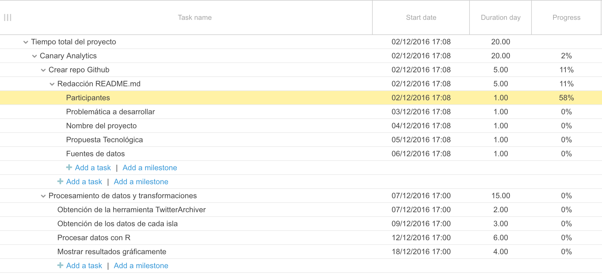
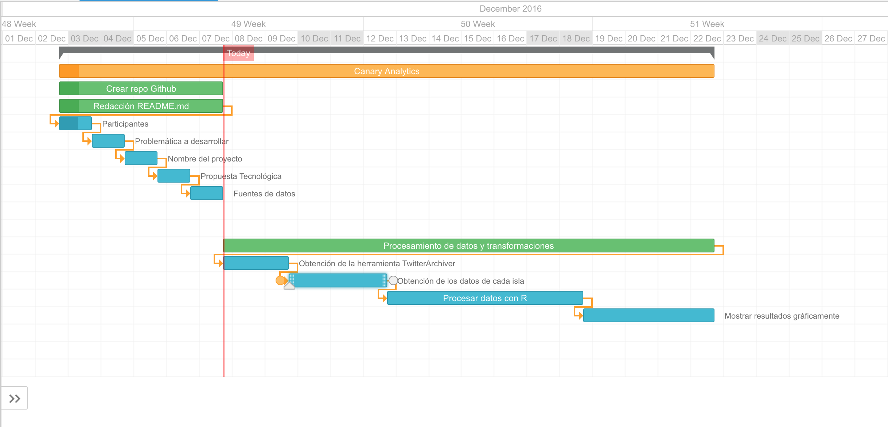

# Proyecto final TIO 2016-2017 Grupo 4


### Participantes:

* Alejandro Arzola García
* Aitor Bernal Falcón
* Carlos de Armas Hernández
* Samuel Ramos Barroso
* Samuel Valcárcel Arce
* Joshua Perez García

### Problemática a desarrollar

Nuestro proyecto consiste en identificar los "tweets" asociados a hashtags en la red social de Twitter relacionados con Canarias, tanto en castellano como en otros idiomas. Una vez los hemos identificado, tenemos en cuenta su valoración (positiva, negativa o neutra) y pasamos a comparar que destino turístico de las Islas Canarias tiene más éxito.

### Nombre de nuestro proyecto

Canary Analytics.

### Propuesta tecnológica

Para realizar nuestro proyecto, vamos a hacer uso de diversas herramientas. La primera es [Twitter archiver](https://chrome.google.com/webstore/detail/twitter-archiver/pkanpfekacaojdncfgbjadedbggbbphi), un "addon" para las hojas de cálculo de ```Google``` que nos permite recopilar los tweets asociados a los "Hashtag" de los puntos de interés turístico en Canarias. La segunda herramienta que usaremos en la [API de Twitter](https://dev.twitter.com/rest/public), que es otra alternativa para obtener tweets, aunque un poco más limitada que la anterior. La tercera herramienta que usaremos es el [lenguaje de programación R](https://www.r-project.org/) apoyados en el IDE [RStudio](https://www.rstudio.com/) para analizar los datos recopilados. Por último, usaremos [Keyhole](http://keyhole.co/), a modo orientativo, esta herramienta para guiarnos en el diseño gráfico.

### Fuentes de datos

Dado que se requiere una gran cantidad de datos, para obtener un resultado fiable hemos obtado por utilizar datos públicos de la red social ```Twitter```. Una vez obtengamos estos datos de ```Twitter```, haciendo uso de las herremientas mencionadas anteriormente, se almacenarán y posteriormente se procesarán dichos datos.


### Procesamiento de datos y transformaciones

La herramienta twitter-archiver nos proporciona los tweets relacionados con el Hashtag indicado y los almacena automáticamente en una hoja de cálculo. Este fichero contiene el nombre de la persona que publica el tweet, el propio mensaje, la geolocalización y otros datos de interés. La idea principal consiste en analizar el texto de los mensajes y así poder obtener datos estadísticos de los lugares más visitados de Canarias, desde donde twitean, datos demográficos, usuarios más influyentes y los dispositivos que más se utilizan.

### Resultados esperados

Como resultado de nuestro proyecto esperamos identificar los lugares turísticos que más repercución tienen, y analizar si dicha repercución es positiva, negativa o neutra.

### Diagrama de Gantt





### Propuestas de modelo de negocios para el desarrollo

La idea de modelo de negocio es hacer ver a las empresas su impacto en las redes sociales, viendo cuánto y cómo se habla de ellos en ```Twitter```, si los comentarios son positivos o negativos.

### Creación de un repositorio de contenidos

El repositorio de nuestro proyecto que vamos a usar: [Repositorio](https://github.com/Grupo-3-TIO/proyecto-final-tio)
